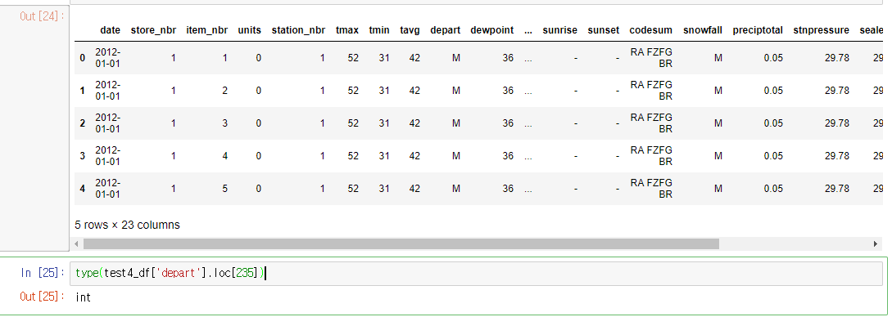

#  Walmart Recruiting II: Sales in Stormy Weather (Kaggle)
*Kaggle* 에 있는  [Walmart Sales in Stormy Weather](https://www.kaggle.com/c/walmart-recruiting-sales-in-stormy-weather) 프로젝트를 진행합니다.

# DataFrame type변환

불러온 DataFrame 이 전부 string type 으로 저장되어 있기 때문에
분석 가능하게 numerical data는 변환 해준다.

# 1. pd.to_numeric

pd.to_numberic, errors = 'ignore' 를 이용하면 numeric으로 변환할수 없는 data가 잇는 column 전체를 변환못한다.
즉 예외데이터가 하나 있으면 column이 변환 안된다.

이를 해결하기 위한 방법
<code>
df.apply(pd.to_numeric, errors = 'coerce')

</code>

errors ='coerce' 를 이용하면 변환 불가능한 데이터는 nan값으로 처리해준다.

# 2.  함수 정의 하여 사용하기. applymap

numeric 데이터 변환시 예외는 pass하는 함수를 try, except를 이용하여 정의한후 사용.
<code>

	def df_to_float(data):
    
	    try:
	        data = float(data)
	    except:
	        pass
    
	    return data
	
	df.applymap(df_to_float)

applymap 은 dataframe 안에 모든 element 에 함수를 적용하여 준다.

</code>

> Written with [StackEdit](https://stackedit.io/).
