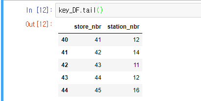
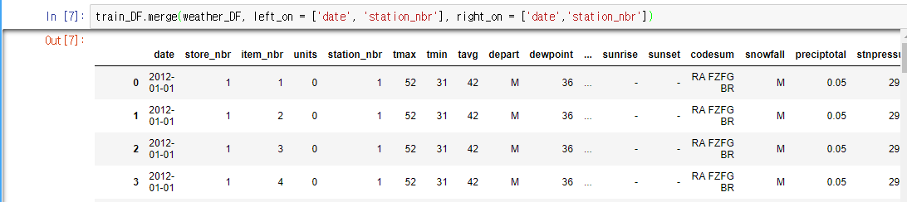

#  Walmart Recruiting II: Sales in Stormy Weather (Kaggle)
*Kaggle* 에 있는  [Walmart Sales in Stormy Weather](https://www.kaggle.com/c/walmart-recruiting-sales-in-stormy-weather) 프로젝트를 진행합니다.

# DataFrame merging

walmart 에서 제공한 data는 csv 파일로 
1. **train.csv** - 해당 날/ 지점/ 상품 의 판매량 - train 용
2. **weather.csv** -해당 날/관측 station의 날씨 정보 
3. **key.csv** - store 번호와 station 번호를 연결해주는 정보

세 가지 파일로 나뉘어 있어 분석전 첫 단계로 데이터를 하나의 dataframe으로 합쳐 줘야 한다.

## Import csv to pd.DataFrame

**Pandas** 에 있는 read_csv method를 통해  csv 파일 블러오기

<code>
		
	train_DF = pd.read_csv('data/train.csv')
		
	key_DF = pd.read_csv('data/key.csv')
	weather_DF = pd.read_csv('data/weather.csv')

	train_DF.apply(pd.to_numeric, errors = 'igonre')
	key_DF.apply(pd.to_numeric, errors = 'igonre')
	weather_DF.apply(pd.to_numeric, errors = 'igonre')

</code>

## 1. Merging by apply()

비교적 간단한  train.df와 key.df는 apply함수를 통해 key data를 mapping 해준다.

(사실은 merge가 될줄 몰라서 만들었다....)

key.csv

<code>

	def store_to_station(store_nbr):
       
	    return key_DF['station_nbr'].iloc[store_nbr-1]

</code>
[ store 숫자를 입력받아 key_df의   'station_nbr'  column에서 위치를 찾아주는 함수 ]

이 함수를 apply를 통해 적용하여 train dataframe에 store 넘버에 매칭되는 station넘버를 칼럼 추가해주었다.
<code>
train_DF['station_nbr'] = train_DF['store_nbr'].apply(store_to_station)
</code>

## 2. Merging by df.merge

df.merge 에서 두 df의 연결되는 column 을 설정 할 수 있는데 이를 2개 이상 설정 가능하다!!

<code>

merge_df = train_DF.merge(weather_DF, left_on = ['date', 'station_nbr'], right_on = ['date','station_nbr'])

</code>

> Written with [StackEdit](https://stackedit.io/).
